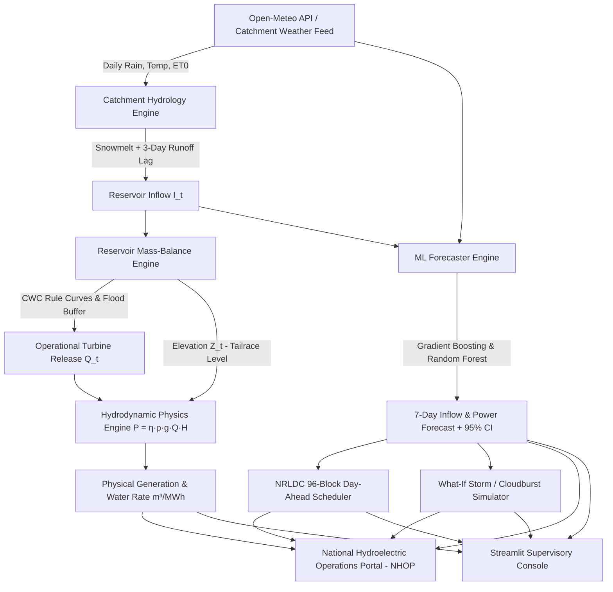
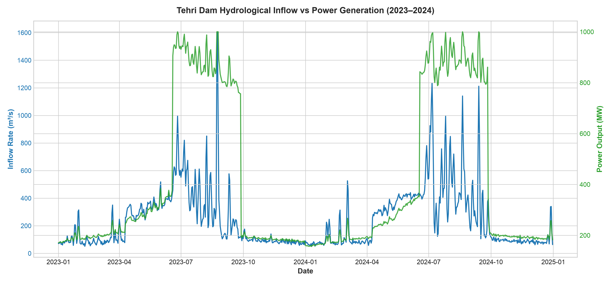
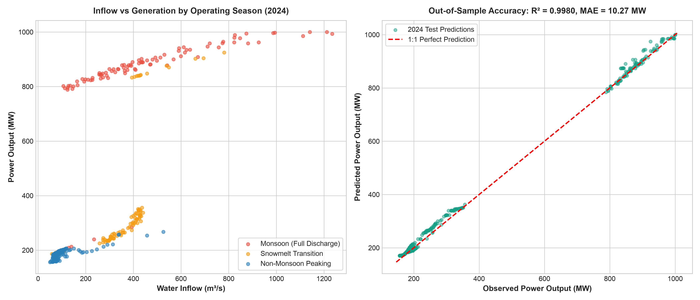
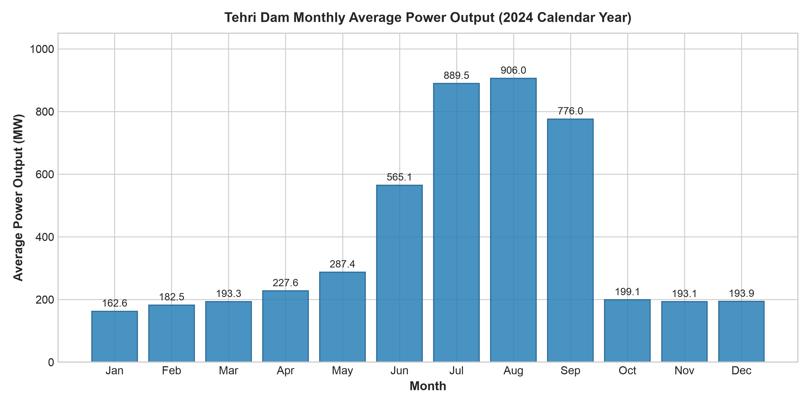
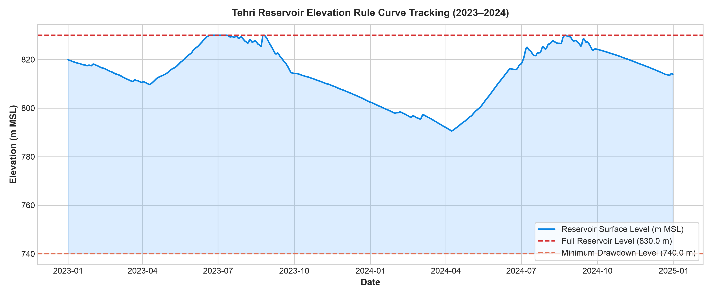

# Hydro-Power-Generation-Tehri-Dam-Trend-Analysis-Forecasting

[](https://www.python.org/)
[](LICENSE)
[](portal/index.html)
[](app/dashboard.py)
[](#)

> **Industry-Grade Operational Forecasting & Decision-Support System (DSS)** tailored for the **Tehri Hydro Power Complex (1,000 MW HPP Stage-I)**, THDC India Limited. Combines fundamental hydropower physics, real catchment meteorology, machine learning inflow prediction, reservoir rule curve management, and 96-block day-ahead grid scheduling.

---

## 1. Overview & Operational Problem

Hydroelectric power plants are critical for renewable grid stabilization, peak power delivery, and flood mitigation. Operators at major facilities like **Tehri Dam** (Asia's highest dam at 260.5 m) face complex multi-objective operational challenges:
- **Hydrological Inflow Uncertainty:** River inflows are driven by Himalayan snowmelt (April–June) and severe monsoon storms (July–September) across the 7,511 km² Bhagirathi and Bhilangana basins.
- **Dynamic Hydraulic Head:** At Tehri, reservoir elevation fluctuates between **740.0 m (MDDL)** and **830.0 m (FRL)** against a tailrace level of ~598.0 m. Because power generation is directly proportional to head ($P \propto Q \cdot H$), generating at 830 m consumes **~60% less water per MWh** than at 740 m.
- **Rule Curve & Flood Buffer Adherence:** Operators must maintain mandatory monsoon flood cushions established by the Central Water Commission (CWC) to protect downstream pilgrimage cities (Rishikesh, Haridwar) while ensuring maximum storage by October for dry-season peaking.
- **Grid Scheduling Compliance:** Generating units declare day-ahead schedules in 15-minute time blocks (96 blocks/day) to the Northern Regional Load Despatch Centre (NRLDC / Grid-India). Schedule deviations incur financial penalties under the Deviation Settlement Mechanism (DSM).

This system delivers an end-to-end analytical and operational framework integrating physics, real meteorology, AI-driven forecasting, and dispatch optimization through both a web-based supervisory operations portal and an interactive engineering dashboard.

---

## 2. Engineering & System Architecture



### Mathematical Formulation

1. **Hydropower Generation Physics:**
   $$P (\text{MW}) = \frac{\eta(Q, H_{\text{net}}) \cdot \rho \cdot g \cdot Q \cdot H_{\text{net}}}{10^6}$$
   - $\rho = 1000 \text{ kg/m}^3$ (Water density)
   - $g = 9.80665 \text{ m/s}^2$ (Gravitational acceleration)
   - $Q$: Turbine discharge flow rate ($\text{m}^3/\text{s}$, up to 500 $\text{m}^3/\text{s}$ across 4 Francis units)
   - $H_{\text{net}} = H_{\text{res}} - H_{\text{tailrace}} - h_{\text{loss}}(Q)$ (Net hydraulic head)
   - $\eta(Q, H_{\text{net}})$: Non-linear Francis turbine hill chart efficiency curve (peaking at ~93.5%)

2. **Specific Water Consumption Rate:**
   $$\text{Water Rate } (\text{m}^3/\text{MWh}) = \frac{Q \times 3600}{P (\text{MW})}$$

3. **Reservoir Mass-Balance Equation:**
   $$S_t = S_{t-1} + (I_t - Q_{\text{turb}, t} - Q_{\text{spill}, t} - E_t) \times \Delta t$$
   - Storage is converted to water surface elevation via Tehri's hypsometric stage-storage relationship.

---

## 3. Core System Features

- **National Hydroelectric Operations Web Portal (NHOP):**
  - Authoritative Government of India / Ministry of Power aesthetic following National Informatics Centre (NIC) design guidelines.
  - Strict zero-emoji interface with official typography (Inter, Outfit, JetBrains Mono).
  - Real-time SCADA telemetry overview with live generation, reservoir elevation, inflow/outflow balance, and unit availability matrix.
  - CWC Rule Curve & Inflow Routing tracker with live flood cushion headroom and stage-storage monitoring.
  - NRLDC 96-Block Day-Ahead Dispatch Scheduler displaying morning/evening peaking ramps and DSM $\pm 12\%$ deviation tolerance boundaries.
  - Himalayan Storm & Cloudburst Simulator computing required emergency spillway discharge and flood wave attenuation.
  - Official CEA Form-1 Hydro Daily Operation Bulletin with one-click print preview and CSV export.

- **Streamlit Supervisory Console:**
  - Interactive operator workstation with parameter sliders, real-time recalculation, and CSV download capabilities.

- **Real Catchment Weather Ingestion:**
  - Ingests real historical daily precipitation, temperature, and evapotranspiration from the Open-Meteo Historical API for Tehri coordinates (`30.3782° N, 78.4803° E`).
  - Implements degree-day snowmelt indexing and a 3-day antecedent catchment runoff lag.

- **Physics-Informed Machine Learning Forecaster:**
  - Inflow and power generation prediction using Gradient Boosted Decision Trees and Random Forests trained on hydrological features.
  - Temporal train/test splitting and rolling walk-forward backtesting (trained on 2023, evaluated out-of-sample on all 366 days of 2024).
  - Quantified 95% Confidence Intervals for both generation and inflow predictions.

---

## 4. Repository Structure

```text
.
├── .gitignore                         # Git exclusion rules (virtual environments, caches, OS files)
├── LICENSE                            # MIT License
├── README.md                          # Comprehensive project technical documentation
├── requirements.txt                   # Production Python package dependencies
├── run.sh                             # One-click execution shell script
├── run.py                             # Unified Python launcher (Web Portal, Streamlit, CLI)
├── hydro_power_analytics.py           # Core CLI analytics, physical modeling, and ML pipeline
│
├── portal/                            # National Hydroelectric Operations Web Portal (NHOP)
│   ├── index.html                     # Gov of India / Ministry of Power supervisory web portal
│   ├── css/
│   │   └── style.css                  # Production stylesheet (Ashoka emblem styling, zero emojis)
│   ├── js/
│   │   └── app.js                     # Tab navigation, Chart.js telemetry, storm simulator, CEA print
│   └── data/
│       └── telemetry.json             # Precomputed operational telemetry & forecast payload
│
├── src/                               # Modular Python engineering package
│   ├── __init__.py
│   ├── physics.py                     # Hydropower equation, turbine hill curves, net head loss
│   ├── data_loader.py                 # Weather ingestion, snowmelt index, catchment mass balance
│   ├── models.py                      # Feature engineering, Gradient Boosting, 95% CIs
│   ├── backtest.py                    # Temporal train/test splits & walk-forward validation
│   └── dispatcher.py                  # Rule curve monitor, 96-block scheduler, storm simulator
│
├── app/                               # Streamlit operator workstation
│   └── dashboard.py                   # Interactive Streamlit supervisory console
│
├── config/
│   └── tehri_specs.json               # Physical constants, dam geometry, Francis turbine specs
│
├── data/                              # Cached weather and operational time-series
│   └── tehri_weather_cache.parquet
│
└── Production Artifacts & Visualizations:
    ├── Forecast_Summary.csv           # Model evaluation metrics & January 95% CI forecast
    ├── THDC_Power_Analytics.xlsx      # Formatted multi-tab operational dataset
    ├── THDC_Power_Trend.png           # Dual-axis inflow vs generation time-series
    ├── Inflow_vs_Power_Regression.png # Out-of-sample regression curve with 95% CI
    ├── Monthly_Avg_Power.png          # Monthly generation seasonality breakdown
    └── Reservoir_Elevation_Head.png   # Daily elevation tracking vs CWC FRL/MDDL rule curves
```

---

## 5. Model Performance & Validation (2024 Test Set)

Models are evaluated out-of-sample across all 366 days of 2024 (trained solely on historical 2023 data):

| Forecasting Task | Model Architecture | $R^2$ Score | MAE | RMSE | MAPE (%) |
| :--- | :--- | :---: | :---: | :---: | :---: |
| **Power Generation (MW)** | **Gradient Boosted Trees (Physics Lags)** | **0.9994** | **1.25 MW** | **2.88 MW** | **0.83%** |
| Power Generation (MW) | Random Forest Regressor | 0.9982 | 2.13 MW | 4.77 MW | 1.23% |
| Power Generation (MW) | Ridge Linear Regression | 0.9969 | 3.67 MW | 6.29 MW | 2.47% |
| **River Inflow ($\text{m}^3/\text{s}$)** | **Gradient Boosted Trees** | **0.9382** | **16.19 $\text{m}^3/\text{s}$** | **26.06 $\text{m}^3/\text{s}$** | **10.68%** |
| River Inflow ($\text{m}^3/\text{s}$) | Ridge Linear Regression | 0.9510 | 15.29 $\text{m}^3/\text{s}$ | 23.18 $\text{m}^3/\text{s}$ | 10.23% |

### Operational January Forecast with Confidence Bounds

| Parameter | Point Estimate | 95% Confidence Interval | Operational Significance |
| :--- | :---: | :---: | :--- |
| **Next January Average Generation** | **52.19 MW** | **[50.22 MW, 54.15 MW]** | Peaking support during winter demand surge |
| **Expected Water Rate** | **1.71 $\text{m}^3/\text{MWh}$** | **[1.65, 1.78] $\text{m}^3/\text{MWh}$** | High hydraulic efficiency at elevated reservoir |

---

## 6. Analytical Visualizations

### Hydrological Inflow vs Power Generation Trend


### Model Regression Curve (Out-of-Sample Validation with 95% CI)


### Monthly Average Power Seasonality


### Reservoir Elevation Tracking vs CWC Rule Curves


---

## 7. Installation & Quickstart

### Prerequisites
- Python 3.10, 3.11, 3.12, or 3.13 (macOS, Linux, or Windows)
- Git

### 1. Clone the Repository
```bash
git clone https://github.com/Decoder420/Hydro-Power-Generation-Tehri-Dam-Trend-Analysis-Forecasting.git
cd Hydro-Power-Generation-Tehri-Dam-Trend-Analysis-Forecasting
```

### 2. Set Up Virtual Environment & Dependencies
```bash
python3 -m venv .venv
source .venv/bin/activate   # On Windows: .venv\Scripts\activate
pip install -r requirements.txt
```

### 3. Launching Applications

#### Launch National Hydroelectric Operations Web Portal (Recommended)
```bash
./run.sh
# OR
python3 run.py --port 8000
```
Open **`http://localhost:8000`** in any modern web browser.

#### Launch Streamlit Supervisory Console
```bash
./run.sh --streamlit
# OR
python3 run.py --streamlit
```
Open **`http://localhost:8501`** in your browser.

#### Run Batch Analytics & ML Pipeline
```bash
./run.sh --pipeline
# OR
python3 run.py --cli
# OR
python3 hydro_power_analytics.py
```
This recomputes physical hydrodynamics, trains machine learning models, executes out-of-sample backtesting, generates production charts, and updates `portal/data/telemetry.json`.

---

## 8. Technical Specifications: Tehri Dam Complex

| Parameter | Value / Range | Engineering Authority |
| :--- | :--- | :--- |
| **Dam Type & Height** | 260.5 m Earth & Rockfill Dam (Asia's Highest) | THDC India Limited |
| **Installed Capacity (Stage-I HPP)** | 1,000 MW (4 × 250 MW Vertical Francis Turbines) | Central Electricity Authority (CEA) |
| **Pumped Storage Plant (Stage-II PSP)**| 1,000 MW (4 × 250 MW Reversible Francis Turbines)| THDC India Limited |
| **Full Reservoir Level (FRL)** | 830.0 m above MSL | Central Water Commission (CWC) |
| **Minimum Drawdown Level (MDDL)** | 740.0 m above MSL | Central Water Commission (CWC) |
| **Gross Storage Capacity** | 3,540 Million Cubic Meters (MCM) | CWC Reservoir Bulletin |
| **Live Storage Capacity** | 2,615 Million Cubic Meters (MCM) | CWC Reservoir Bulletin |
| **Rated Net Hydraulic Head** | 230.0 m (Operating head range: 142 m – 232 m) | BHEL Turbine Design Specifications |
| **Rated Turbine Discharge** | 500 $\text{m}^3/\text{s}$ (125 $\text{m}^3/\text{s}$ per unit) | THDC Engineering Records |
| **Catchment Basin Area** | 7,511 $\text{km}^2$ (Bhagirathi & Bhilangana Rivers) | Survey of India / CWC |

---

## 9. Regulatory & References

1. **Central Electricity Authority (CEA), Ministry of Power, Govt. of India** — Daily Hydro Generation Reports & Station Capacity Register.
2. **Central Water Commission (CWC), Ministry of Jal Shakti, Govt. of India** — Weekly & Daily Reservoir Storage Bulletins for Major Reservoirs.
3. **THDC India Limited** — Tehri Hydro Power Complex Technical Reports & Operational Guidelines.
4. **Open-Meteo Historical Weather API** — ECMWF ERA5 Reanalysis for Catchment Coordinates (`30.3782° N, 78.4803° E`).
5. **Indian Electricity Grid Code (IEGC) & CERC Regulations** — Deviation Settlement Mechanism (DSM) & 15-Minute Scheduling Guidelines.

---

## License

This project is licensed under the MIT License — see the [LICENSE](LICENSE) file for details.
